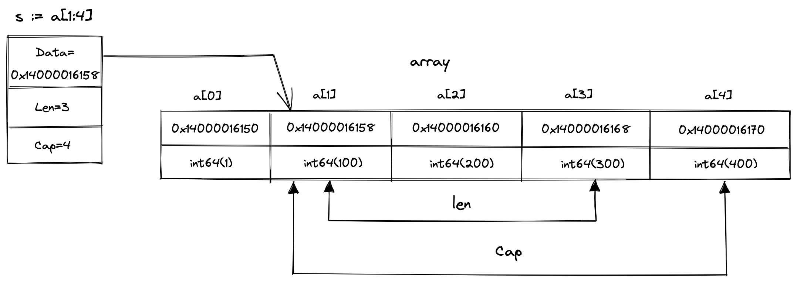

# 切片介绍

## 创建切片

创建切片的方式有如下几种：
1. 使用字面表示
2. 指向已经存在的数组
3. 指向已经存在的其他切片
4. 使用make关键字

代码示例如下：
```go
// Using slice literal:
s1 := []int{1, 2, 3, 4, 5}

//Using an Array:
a1 := [5]int{1, 2, 3, 4, 5}
s2 := a1[:]

//Using already Existing Slice:
s3 := s2[:]

//Using make() function:
s4 := make([]int, 4, 7)
s5 := make([]int, 7)
```

使用 make：

make 函数有两个或三个参数：切片的类型、长度和可选容量。 make 函数返回一个具有指定长度和容量的新初始化切片。 容量参数指定底层数组可以容纳的元素数量，默认为长度参数。

## 切片的操作
1. 索引：可以使用索引运算符 [] 访问切片的元素。 索引必须在切片的范围内，范围是从 0 到长度 1。
2. 追加：追加函数将一个或多个元素追加到切片并返回结果切片。 如果底层数组容量不足，则会分配一个新数组。
3. 切割：切片可以被切片以创建一个新切片，该新切片引用原始切片元素的子集。 切片的语法是 [low:high]，其中 low 是要包含在切片中的第一个元素的索引，high 是要从切片中排除的第一个元素的索引。
4. 复制：使用内置copy函数复制切片。

## 底层数据结构

```go
type SliceHeader struct {
	Data uintptr
	Len  int
	Cap  int
}
```

